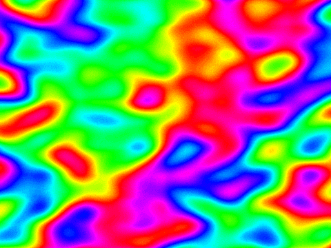

# Plasma Effect

Old-school color cycling animation,
implemented in [Scratch 2.0](https://scratch.mit.edu/).

https://scratch.mit.edu/projects/64094436/#fullscreen

## Project

https://scratch.mit.edu/projects/64094436/

All variables, scripts, backdrops and sound mentioned below
are part of the stage;
the project has no sprites.

Project notes:
- [Instructions](project/instructions.txt)
- [Notes and Credits](project/notes-and-credits.txt)

Thumbnail (currently used for my [studio](https://scratch.mit.edu/studios/1260238)):


## Variables

The project has a single variable named 'speed'.
It is permanently visible in the bottom right corner,
rendered with a slider ranging from -20 to +20.
Its initial value is +4.

## Scripts


```
when green flag clicked
forever
    change [color v] effect by (speed)
end

when this sprite clicked
next backdrop

when [space v] key pressed
next backdrop

when green flag clicked
forever
    play sound [lava-loop v] until done
end
```

Scratchblocks renditions:
- [Snapshot](http://scratchblocks.github.io/#when%20green%20flag%20clicked%0Aforever%0A%20%20%20%20change%20[color%20v]%20effect%20by%20%28speed%29%0Aend%0A%0A%0Awhen%20this%20sprite%20clicked%0Anext%20backdrop%0A%0A%0Awhen%20[space%20v]%20key%20pressed%0Anext%20backdrop%0A%0A%0Awhen%20green%20flag%20clicked%0Aforever%0A%20%20%20%20play%20sound%20[lava-loop%20v]%20until%20done%0Aend)
- [Generated from current project](http://scratchblocks.github.io/generator/#project=64094436).

## Backdrops

All backdrops have been created using [GIMP](http://www.gimp.org).
[Here's how](doc/howto.md).





## Sound

[Lava loop](https://www.freesound.org/people/Audionautics/sounds/133901/)
by [Audionautics](https://www.freesound.org/people/Audionautics/).
